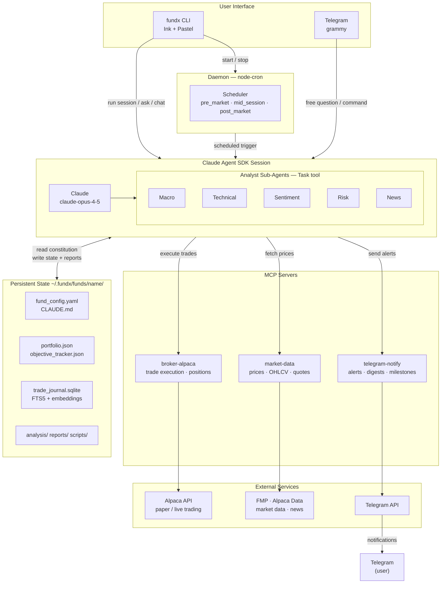

# FundX — Autonomous AI Fund Manager

> **CLI-first, goal-oriented, multi-fund autonomous investment platform powered by the Claude Agent SDK.**

FundX lets you define investment funds with **real-life financial objectives** and delegates analysis, decision-making, and trade execution to Claude running autonomously via scheduled sessions.

## What Makes FundX Different

- **Goal-oriented, not return-oriented.** You say "I have $30k, I spend $2k/month, give me 18 months of runway" — not "beat the S&P."
- **Claude as artisan.** Each session, Claude invents analysis tools, writes scripts, searches the web, and makes decisions — not limited to pre-defined pipelines.
- **Multi-fund architecture.** Run a conservative runway fund, an aggressive growth fund, and a BTC accumulation fund simultaneously, each with its own AI personality.
- **Bidirectional Telegram.** Get trade alerts AND wake Claude anytime to ask questions about positions or past analyses.
- **Paper first, live later.** Every fund starts in paper mode. Live trading requires explicit confirmation and safety checks.

## Prerequisites

- **Node.js** >= 20
- **Anthropic API key** (`ANTHROPIC_API_KEY` environment variable)
- **pnpm** (recommended) or npm
- **Alpaca** account for paper/live trading (optional for setup)
- **FMP API key** for market data — free tier at [financialmodelingprep.com](https://financialmodelingprep.com) (optional, falls back to Alpaca)
- **Telegram** bot token for notifications (optional)

## Installation

```bash
# From npm (when published)
npm install -g fundx

# From source
git clone https://github.com/machester4/fundx.git
cd fundx
pnpm install
pnpm build
pnpm link --global
```

## Quick Start

```bash
# 1. Initialize workspace
fundx init

# 2. Create your first fund
fundx fund create

# 3. Open the dashboard (fullscreen TUI with integrated chat)
fundx

# 4. Run a manual session
fundx session run <fund-name> pre_market

# 5. Start the daemon (automated sessions)
fundx start
```

## Fund Objective Types

| Type | You say... | Claude optimizes for... |
|------|-----------|------------------------|
| `runway` | "I have $30k, burn $2k/mo, give me 18 months" | Sustaining monthly expenses |
| `growth` | "Turn $10k into $20k in 2 years" | Capital multiplication |
| `accumulation` | "Accumulate 1 BTC by 2027" | Acquiring target amount of an asset |
| `income` | "Generate $500/mo passive income" | Consistent income generation |
| `custom` | "Your own objective description" | Whatever you define |

## CLI Reference

### Core Commands

```
fundx                               Fullscreen TUI dashboard with chat REPL
fundx init                          Initialize FundX workspace (~/.fundx/)
fundx status                        Quick status of all funds and services
fundx chat                          Interactive chat REPL (standalone)
fundx start [fund|all]              Start daemon scheduler
fundx stop [fund|all]               Stop daemon
fundx logs [fund] [-f|--follow]     View logs
```

### Fund Management

```
fundx fund create                   Interactive fund creation wizard
fundx fund list                     List all funds with status
fundx fund info <name>              Detailed fund information
fundx fund pause <name>             Pause a fund (keeps state)
fundx fund resume <name>            Resume a paused fund
fundx fund delete <name>            Delete a fund (requires confirmation)
fundx fund clone <source> <name>    Clone fund configuration
```

### Analysis & Interaction

```
fundx ask <fund> "<question>"       Wake Claude to answer about a fund
fundx ask --cross "<question>"      Cross-fund analysis
fundx session run <fund> <type>     Trigger a session (pre_market/mid_session/post_market)
```

### Portfolio & Performance

```
fundx portfolio <fund>              Current holdings and allocation
fundx trades <fund> [--today]       Recent trades
fundx performance <fund>            Performance metrics
fundx chart <fund> [type]           Terminal charts (allocation, pnl, sparkline)
fundx report <fund> [--weekly]      View/generate reports
fundx montecarlo <fund>             Monte Carlo runway projections
fundx correlation                   Cross-fund correlation analysis
```

### Templates

```
fundx template list                 List available fund templates
fundx template export <fund> <file> Export fund config as template
fundx template import <file>        Create fund from template
```

### Gateway (Telegram)

```
fundx gateway start                 Start Telegram bot standalone
fundx gateway test                  Send test message
```

### Live Trading

```
fundx live enable <fund>            Enable live trading (with safety checks)
fundx live disable <fund>           Switch back to paper trading
fundx live status <fund>            View live trading status
```

## Architecture



Each Claude session:
1. Reads the fund's `CLAUDE.md` (its constitution) and `fund_config.yaml`
2. Reads persistent state (portfolio, journal, past analyses)
3. Creates and executes analysis scripts as needed
4. Optionally invokes analyst sub-agents via the Task tool (macro, technical, sentiment, risk, news)
5. Makes decisions within fund constraints
6. Executes trades via MCP broker server
7. Updates state and generates reports
8. Sends notifications via Telegram

### Workspace Structure

```
~/.fundx/
├── config.yaml                     # Global config (broker keys, market data, Telegram token)
├── daemon.pid / daemon.log         # Daemon state
├── funds/
│   └── <fund-name>/
│       ├── CLAUDE.md               # AI constitution (auto-generated)
│       ├── fund_config.yaml        # Fund parameters
│       ├── state/                  # portfolio.json, objective_tracker.json,
│       │                           # trade_journal.sqlite, session_log.json
│       ├── analysis/               # Session analysis archive
│       ├── scripts/                # Reusable scripts Claude created
│       └── reports/                # daily/, weekly/, monthly/
├── shared/
│   ├── mcp-servers/                # MCP server configs
│   └── templates/                  # Fund templates
└── gateway/                        # Telegram bot state
```

### MCP Servers

| Server | Purpose |
|--------|---------|
| `broker-alpaca` | Trade execution, positions, account info |
| `market-data` | Price data, OHLCV bars, quotes |
| `telegram-notify` | Send notifications to Telegram |

### Multi-Broker Support

FundX uses a broker adapter interface. Currently Alpaca is implemented; additional brokers are planned:

| Broker | Asset Types | Status |
|--------|-------------|--------|
| Alpaca | Stocks, ETFs, Crypto | Implemented |
| Interactive Brokers | International markets | Planned |
| Binance | Crypto | Planned |

### Market Data Providers

Dashboard indices (S&P 500, NASDAQ, VIX), news headlines, and market hours come from a configurable market data provider:

| Provider | Data | Status |
|----------|------|--------|
| FMP (Financial Modeling Prep) | Real index symbols (^GSPC, ^IXIC, ^VIX), news, market hours | Default, free tier (250 req/day) |
| Alpaca Data API | ETF proxies (SPY, QQQ, VIXY), news, market clock | Fallback (uses broker credentials) |

FMP is preferred because it provides actual index data instead of ETF proxies, and doesn't require brokerage credentials. If no FMP key is configured, the dashboard falls back to Alpaca data (if broker credentials are set), or shows empty panels gracefully.

## Configuration

### Global Config (`~/.fundx/config.yaml`)

Created by `fundx init`. Stores broker credentials, market data provider, Telegram token, and default settings. Credentials are **never** stored in per-fund configs.

```yaml
# Market data provider (optional — dashboard indices, news, market hours)
market_data:
  provider: fmp           # "fmp" (default) or "alpaca"
  fmp_api_key: YOUR_KEY   # Free tier: 250 req/day at financialmodelingprep.com
```

### Fund Config (`fund_config.yaml`)

Each fund is fully defined by its config. Key sections:

- **fund** — Name, description, status
- **capital** — Initial capital, currency
- **objective** — Goal type and parameters
- **risk** — Profile, max drawdown, stop-loss, position limits, custom rules
- **universe** — Allowed/forbidden asset types and tickers
- **schedule** — Trading sessions with times and focus areas
- **broker** — Provider and mode (paper/live)
- **notifications** — Telegram alerts, quiet hours, priority overrides
- **claude** — Model, personality, decision framework

See the [full schema example](https://github.com/machester4/fundx#fund-configuration-schema) in the design document.

## Telegram Integration

### Quick Commands (instant, no Claude needed)

```
/status [fund]    — Fund status summary
/portfolio fund   — Current holdings
/trades fund      — Recent trades
/pause fund       — Pause a fund
/resume fund      — Resume a fund
/next             — Next scheduled sessions
```

### Free Questions (wakes Claude)

Any non-command message wakes Claude with full fund context:

```
You: "why did you sell GDXJ yesterday?"
Bot: [Claude explains with references to its analysis archive]

You: "which fund has the most risk this week?"
Bot: [Cross-fund analysis comparing all active funds]
```

### Notifications

Trade alerts, stop-loss triggers, daily/weekly digests, milestone alerts, and runway warnings — with quiet hours and priority overrides.

## Tech Stack

| Component | Technology |
|-----------|-----------|
| Language | TypeScript (Node.js 20+, ESM) |
| CLI | Ink (React for CLI) + Pastel (file-based routing) + @inkjs/ui |
| Config | YAML (js-yaml) + Zod validation |
| State DB | SQLite (better-sqlite3) |
| Daemon | node-cron |
| Telegram | grammy |
| AI Engine | Claude Agent SDK (@anthropic-ai/claude-agent-sdk) |
| MCP | @modelcontextprotocol/sdk |
| Market Data | FMP (primary) / Alpaca Data API (fallback) |
| Broker | Alpaca API |
| Build | tsup (prod) / tsx (dev) |
| Test | Vitest |

## Development

```bash
pnpm install              # Install dependencies
pnpm dev -- --help        # Run CLI in dev mode (tsx)
pnpm build                # Build for production (tsup)
pnpm start -- --help      # Run production build
pnpm test                 # Run tests (vitest)
pnpm lint                 # Lint (eslint)
pnpm format               # Format (prettier)
pnpm typecheck            # Type check (tsc --noEmit)
```

## Design Principles

1. **Goal-first, not trade-first.** Every decision is evaluated against the fund's life objective.
2. **Claude as artisan.** No pre-defined pipeline — Claude creates scripts, research, and calculations as needed.
3. **Declarative funds.** A fund is fully defined by `fund_config.yaml`. Everything else is derived.
4. **State is king.** Everything persists between sessions. Claude always knows where it left off.
5. **Human in the loop, not in the way.** Autonomous operation with CLI/Telegram intervention available.
6. **Paper first, live later.** Every fund starts in paper mode.
7. **Memory makes it smarter.** Trade journal + FTS5 search enables learning from history.
8. **Open and extensible.** New brokers, MCP servers, and objective types are all pluggable.

## Inspiration & Prior Art

| Project | What we take | What we improve |
|---------|-------------|-----------------|
| [TradingAgents](https://github.com/TauricResearch/TradingAgents) | Multi-agent debate architecture | FundX runs continuously with persistent memory and real execution |
| [Prophet Trader](https://github.com/JakeNesler/Claude_Prophet) | Claude Code + MCP + Alpaca | FundX is multi-fund, goal-oriented |
| [Agentic Investment Management](https://github.com/hvkshetry/agentic-investment-management) | 12 specialist sub-agents, MCP servers | FundX provides a simple CLI with interactive setup |
| [CC Trading Terminal](https://github.com/degentic-tools/claude-code-trading-terminal) | Sub-agents for parallel execution | FundX supports any asset class, not just crypto |

### Key Papers

- **TradingAgents** — Xiao et al., 2024. [arXiv:2412.20138](https://arxiv.org/abs/2412.20138)
- **Trading-R1** — Tauric Research, 2025. [arXiv:2509.11420](https://arxiv.org/abs/2509.11420)
- **FinMem** — Yu et al., 2023. [arXiv:2311.13743](https://arxiv.org/abs/2311.13743)
- **FinRobot** — Yang et al., 2024. [arXiv:2405.14767](https://arxiv.org/abs/2405.14767)

## License

[Apache License 2.0](LICENSE)

## Contributing

Contributions welcome! Please open an issue to discuss before submitting PRs.
