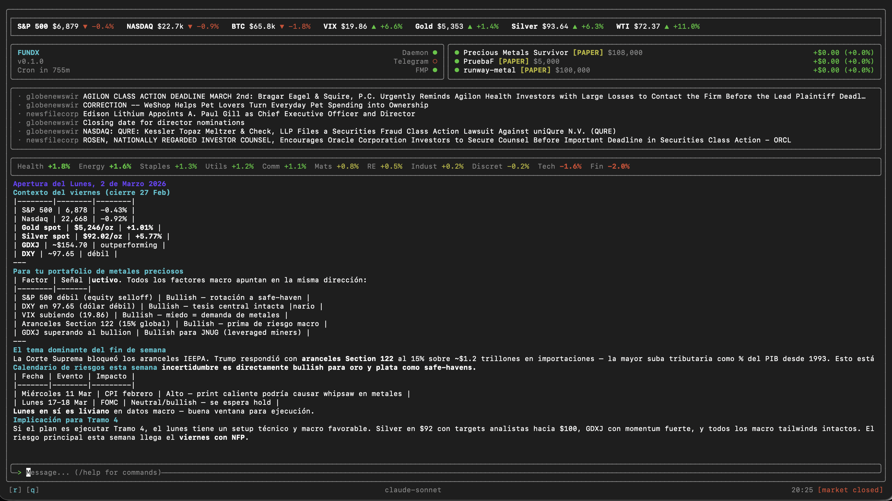
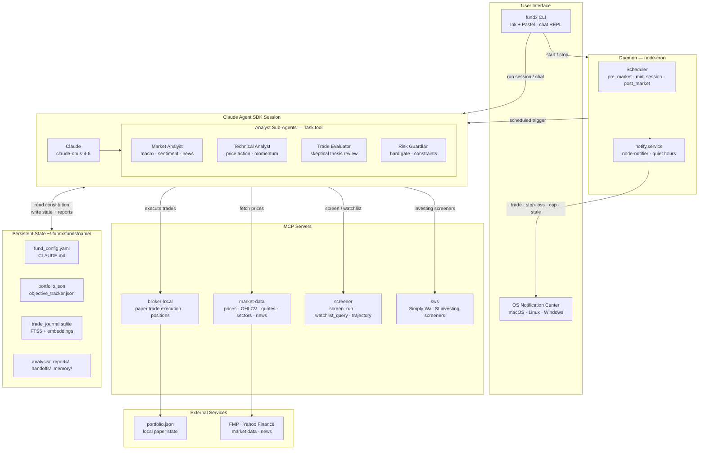

# FundX — Autonomous AI Fund Manager

[](LICENSE)
[]()
[]()
[]()

> **CLI-first, goal-oriented, multi-fund autonomous investment platform powered by the Claude Agent SDK.**

FundX lets you define investment funds with **real-life financial objectives** and delegates analysis, decision-making, and trade execution to Claude running autonomously via scheduled sessions.



## Table of Contents

- [What Makes FundX Different](#what-makes-fundx-different)
- [Quick Start](#quick-start)
- [Prerequisites](#prerequisites)
- [Installation](#installation)
- [Fund Objective Types](#fund-objective-types)
- [CLI Reference](#cli-reference)
- [Architecture](#architecture)
- [Configuration](#configuration)
- [Per-Fund Universe](#per-fund-universe)
- [Notifications](#notifications)
- [Tech Stack](#tech-stack)
- [Development](#development)
- [Roadmap](#roadmap)
- [Design Principles](#design-principles)
- [Contributing](#contributing)
- [Inspiration & Prior Art](#inspiration--prior-art)
- [License](#license)

## What Makes FundX Different

- **Goal-oriented, not return-oriented.** You say "I have $30k, I spend $2k/month, give me 18 months of runway" — not "beat the S&P."
- **Claude as artisan.** Each session, Claude invents analysis tools, writes scripts, searches the web, and makes decisions — not limited to pre-defined pipelines.
- **Multi-fund architecture.** Run a conservative runway fund, an aggressive growth fund, and a BTC accumulation fund simultaneously, each with its own AI personality.
- **Native OS notifications.** Trade executions, stop-loss triggers, daily-cap hits, and supervisor stalls land in macOS Notification Center / Linux libnotify / Windows toast — with quiet hours and a `notifications.enabled` master switch.
- **Conversational UI.** A fullscreen TUI dashboard with an integrated chat REPL handles questions, reports, charts, and ad-hoc analysis — no extra subcommands needed.
- **Paper mode.** All trading is simulated locally — you replicate positions in your real broker manually.

## Quick Start

```bash
# 1. Initialize workspace
fundx init

# 2. Create your first fund
fundx fund create

# 3. Open the dashboard (fullscreen TUI with integrated chat)
fundx

# 4. Run a manual session
fundx session run <fund-name> pre_market

# 5. Start the daemon (automated sessions)
fundx start
```

## Prerequisites

- **Node.js** >= 20
- **Anthropic API key** (`ANTHROPIC_API_KEY` environment variable)
- **pnpm** (recommended) or npm
- **FMP API key** for market data — free tier at [financialmodelingprep.com](https://financialmodelingprep.com) (recommended, falls back to Yahoo Finance)

## Installation

```bash
# From source (recommended during early development)
git clone https://github.com/machester4/fundx.git
cd fundx
pnpm install
pnpm build
pnpm link --global
```

> `npm install -g fundx` coming soon.

## Fund Objective Types

| Type | You say... | Claude optimizes for... |
|------|-----------|------------------------|
| `runway` | "I have $30k, burn $2k/mo, give me 18 months" | Sustaining monthly expenses |
| `growth` | "Turn $10k into $20k in 2 years" | Capital multiplication |
| `accumulation` | "Accumulate 1 BTC by 2027" | Acquiring target amount of an asset |
| `income` | "Generate $500/mo passive income" | Consistent income generation |
| `custom` | "Your own objective description" | Whatever you define |

## CLI Reference

The CLI surface intentionally stays small. Most day-to-day questions —
portfolios, trades, performance, charts, reports, correlation, Monte Carlo
projections, ad-hoc analysis — are handled by the integrated chat REPL inside
`fundx`. Only operational primitives have dedicated commands.

### Core Commands

```
fundx                               Fullscreen TUI dashboard with chat REPL
  --fund <name>                     Open with a specific fund selected
  --model <model>                   Claude model (sonnet, opus, haiku)
  --readonly                        Read-only mode (no trades)
  --max-budget <usd>                Maximum budget in USD for the session
fundx init                          Initialize FundX workspace (~/.fundx/)
fundx status                        Quick status of all funds and services
fundx start [fund|all]              Start daemon scheduler (cron + notifications)
fundx stop [fund|all]               Stop daemon
```

### Fund Management

```
fundx fund create                       Interactive fund creation wizard
fundx fund delete <name>                Delete a fund (requires confirmation)
fundx fund upgrade -n <name>            Regenerate CLAUDE.md and rewrite skills/rules
fundx fund upgrade --all                Upgrade all funds at once
fundx fund consolidate <name>           Force a memory-consolidation run (backfill)
fundx fund refresh-universe <name>      Force universe re-resolution (FMP)
fundx fund refresh-universe --all       Refresh universe for all active funds
```

### Sessions

```
fundx session run <fund> <type>     Manually trigger a session
                                    (pre_market | mid_session | post_market | news_reaction | meta_reflection | ...)
```

### Simply Wall St (optional)

```
fundx sws login                     Authenticate with Simply Wall St
fundx sws logout                    Clear credentials
fundx sws status                    Show current SWS session
```

### Development

```
fundx eval                          Run the full prompt eval suite (MVP + backlog, ~$2.50)
fundx eval --filter mvp-            Run MVP cases only (8 cases, ~$1.70 — what nightly CI runs)
fundx eval --case <id> --runs 1     Run a single case once (~$0.02 dev loop)
fundx eval --json <path>            Write the JSON report to disk
```

The eval harness exercises the chat and ask surfaces against canonical YAML cases under
`tests/eval/cases/`. Used as a regression gate when modifying skills, rules, or prompt
construction. See [CLAUDE.md](CLAUDE.md#prompt-eval-harness) for details.

## Architecture


```mermaid
graph TB
    subgraph UI["User Interface"]
        CLI["fundx CLI\nInk + Pastel · chat REPL"]
        OSN["OS Notification Center\nmacOS · Linux · Windows"]
    end

    subgraph Daemon["Daemon — node-cron"]
        SCHED["Scheduler\npre_market · mid_session · post_market"]
        NOTIFY["notify.service\nnode-notifier · quiet hours"]
    end

    subgraph Session["Claude Agent SDK Session"]
        CLAUDE["Claude\nclaude-opus-4-6"]
        subgraph SubAgents["Analyst Sub-Agents — Task tool"]
            SA1["Market Analyst\nmacro · sentiment · news"]
            SA2["Technical Analyst\nprice action · momentum"]
            SA3["Trade Evaluator\nskeptical thesis review"]
            SA4["Risk Guardian\nhard gate · constraints"]
        end
    end

    subgraph MCP["MCP Servers"]
        MCP1["broker-local\npaper trade execution · positions"]
        MCP2["market-data\nprices · OHLCV · quotes · sectors · news"]
        MCP3["screener\nscreen_run · watchlist_query · trajectory"]
        MCP4["sws\nSimply Wall St investing screeners"]
    end

    subgraph State["Persistent State  ~/.fundx/funds/name/"]
        ST1["fund_config.yaml\nCLAUDE.md"]
        ST2["portfolio.json\nobjective_tracker.json"]
        ST3["trade_journal.sqlite\nFTS5 + embeddings"]
        ST4["analysis/  reports/  handoffs/  memory/"]
    end

    subgraph Ext["External Services"]
        EXT1["portfolio.json\nlocal paper state"]
        EXT2["FMP · Yahoo Finance\nmarket data · news"]
    end

    CLI -->|"run session / chat"| Session
    CLI -->|"start / stop"| Daemon
    Daemon -->|"scheduled trigger"| Session
    Daemon --> NOTIFY
    NOTIFY -->|"trade · stop-loss · cap · stale"| OSN

    Session <-->|"read constitution\nwrite state + reports"| State
    CLAUDE --> SubAgents

    Session -->|"execute trades"| MCP1
    Session -->|"fetch prices"| MCP2
    Session -->|"screen / watchlist"| MCP3
    Session -->|"investing screeners"| MCP4

    MCP1 --> EXT1
    MCP2 --> EXT2
```

Each Claude session:
1. **Orient** — Receives a pre-built `<state_snapshot>` envelope (handoff + portfolio + objective + pending verdicts + top trades + top watchlist) and writes a Session Contract declaring intent.
2. **Analyze** — Classifies market regime. Invokes market-analyst and technical-analyst sub-agents via the Task tool. Writes analysis to `analysis/`.
3. **Decide** — Applies the pre-trade checklist. Skips if conviction is below threshold.
4. **Validate** — Two gates: trade-evaluator (skeptical thesis review) → risk-guardian (hard constraint check). Both must pass — enforced by an SDK `PreToolUse` hook on `place_order`.
5. **Execute** — Paper trades via `broker-local` MCP server (updates portfolio.json locally).
6. **Reflect** — Grades decisions, evaluates Session Contract, writes full handoff to `session-handoff.md`; the previous handoff is archived under `state/handoffs/<iso-ts>_<session-type>.md`.
7. **Notify (daemon-driven)** — The daemon's `trade-watcher` and `stoploss` services emit OS notifications for new trades, stop-loss exits, daily-cap hits, supervisor stalls, and missing handoffs. The agent itself never calls a notify tool.
8. **Follow-up** — Optionally self-schedules future sessions for monitoring.

### Workspace Structure

```
~/.fundx/
├── config.yaml                     # Global config (market data, notifications)
├── daemon.pid / daemon.log         # Daemon state
├── daemon.heartbeat                # Supervisor heartbeat mtime
├── funds/
│   └── <fund-name>/
│       ├── CLAUDE.md               # AI constitution (auto-generated)
│       ├── fund_config.yaml        # Fund parameters
│       ├── state/                  # portfolio.json, objective_tracker.json,
│       │                           # trade_journal.sqlite, session_log.jsonl,
│       │                           # session-handoff.md, handoffs/,
│       │                           # last_consolidation.json, daily_cap_state.json
│       ├── analysis/               # Session analysis archive
│       ├── memory/                 # Distilled lessons (meta_reflection)
│       ├── scripts/                # Reusable scripts Claude created
│       └── reports/                # daily/, weekly/, monthly/
└── shared/
    ├── mcp-servers/                # MCP server configs
    └── templates/                  # Fund templates
```

### MCP Servers

| Server | Purpose |
|--------|---------|
| `broker-local` | Paper trade execution, positions, account info (local portfolio.json) |
| `market-data` | Price data, OHLCV bars, quotes (FMP + Yahoo Finance, in-process) |
| `screener` | FMP-backed screener + persistent watchlist (`screen_run`, `watchlist_query/trajectory/tag`) |
| `sws` | Simply Wall St investing screeners (optional, requires `fundx sws login`) |

### Market Data Providers

Dashboard indices (S&P 500, NASDAQ, VIX), news headlines, and market hours come from a configurable market data provider:

| Provider | Data | Status |
|----------|------|--------|
| FMP (Financial Modeling Prep) | Real index symbols (^GSPC, ^IXIC, ^VIX), news, market hours | Default, free tier (250 req/day) |
| Yahoo Finance | Fallback for quotes, bars, options | Fallback (no API key needed) |

FMP is recommended because it provides actual index data and comprehensive financial APIs. If no FMP key is configured, the system falls back to Yahoo Finance.

## Configuration

### Global Config (`~/.fundx/config.yaml`)

Created by `fundx init`. Stores market data provider, notification preferences, and default settings.

```yaml
# Market data provider (optional — dashboard indices, news, market hours)
market_data:
  provider: fmp           # "fmp" (default) or "yfinance"
  fmp_api_key: YOUR_KEY   # Free tier: 250 req/day at financialmodelingprep.com
```

### Fund Config (`fund_config.yaml`)

Each fund is fully defined by its config. Key sections:

- **fund** — Name, description, status
- **capital** — Initial capital, currency
- **objective** — Goal type and parameters
- **risk** — Profile, max drawdown, stop-loss, position limits, custom rules
- **universe** — Allowed/forbidden asset types and tickers
- **schedule** — Trading sessions with times and focus areas
- **broker** — Mode (paper)
- **claude** — Model, personality, decision framework

Notification preferences (enabled flag, quiet hours, allow-critical override) live in the *global* `~/.fundx/config.yaml`, not per-fund — see the [Notifications](#notifications) section below.

<details>
<summary>Full fund_config.yaml schema</summary>

```yaml
fund:
  name: my-runway-fund            # Unique identifier (slug)
  display_name: My Runway Fund    # Human-readable name
  description: "18-month living expense runway"
  created: "2025-01-01T00:00:00Z"
  status: active                  # active | paused | closed

capital:
  initial: 30000
  currency: USD

# Objective — pick one type:
objective:
  # runway: sustain monthly expenses for N months
  type: runway
  target_months: 18
  monthly_burn: 2000
  min_reserve_months: 3

  # growth: multiply capital by a target
  # type: growth
  # target_multiple: 2
  # target_amount: 60000
  # timeframe_months: 24

  # accumulation: acquire a target amount of an asset
  # type: accumulation
  # target_asset: BTC
  # target_amount: 1
  # deadline: "2027-01-01"

  # income: generate passive monthly income
  # type: income
  # target_monthly_income: 500
  # income_assets: [JEPI, SCHD]

  # custom: free-form objective
  # type: custom
  # description: "Outperform the S&P 500 with less volatility"
  # success_criteria: "Sharpe ratio > 1.5 over 12 months"

risk:
  profile: moderate               # conservative | moderate | aggressive | custom
  max_drawdown_pct: 15            # Max portfolio drawdown before pause
  max_position_pct: 25            # Max single position size (% of portfolio)
  max_leverage: 1                 # 1 = no leverage
  stop_loss_pct: 8                # Per-position stop-loss
  max_daily_loss_pct: 5           # Daily loss limit before halting
  correlation_limit: 0.8          # Max allowed correlation between positions
  custom_rules:
    - "Never hold more than 2 gold-related ETFs simultaneously"

universe:
  # Either a canonical index preset:
  preset: sp500                  # sp500 | nasdaq100 | dow30
  # OR custom FMP screener filters (mutually exclusive with preset):
  # filters:
  #   market_cap_min: 10_000_000_000
  #   exchange: [NYSE, NASDAQ]
  #   country: US
  #   sector: [Technology, Healthcare]
  #   is_actively_trading: true
  #   limit: 500

  # Always-in tickers (bypass universe filters, hard-included):
  include_tickers: [TSM]
  # Hard-block tickers (cannot be traded, no override):
  exclude_tickers: [TSLA]
  # Hard-block sectors (FMP canonical names like Technology, Energy, Healthcare):
  exclude_sectors: []

schedule:
  timezone: America/New_York
  trading_days: [MON, TUE, WED, THU, FRI]
  sessions:
    pre_market:
      time: "08:00"
      enabled: true
      focus: "Review overnight news, set watchlist, plan the day"
      max_duration_minutes: 20
    mid_session:
      time: "12:00"
      enabled: true
      focus: "Check positions, react to intraday moves"
      max_duration_minutes: 15
    post_market:
      time: "16:30"
      enabled: true
      focus: "Review trades, update journal, plan tomorrow"
      max_duration_minutes: 20
  special_sessions:
    - trigger: FOMC
      time: "13:45"
      focus: "Prepare for Fed announcement volatility"
      enabled: true
      max_duration_minutes: 30

broker:
  mode: paper                     # Paper trading (local simulation)

claude:
  model: sonnet                   # sonnet | opus | haiku
  personality: "Cautious and data-driven. Prioritizes capital preservation over returns."
  decision_framework: "Always ask: does this move the runway needle? If not, skip it."
```

</details>

## Per-Fund Universe

Each fund has a `universe` block in its `fund_config.yaml` that defines which tickers the fund trades. The universe drives screening, gates trade execution, and is exposed to the AI agent as part of its session context.

### Two modes

**Preset (canonical index membership):**
```yaml
universe:
  preset: sp500          # sp500 | nasdaq100 | dow30
  include_tickers: [TSM] # always-in, bypasses universe filters
  exclude_tickers: []    # hard-block these tickers
  exclude_sectors: []    # hard-block these FMP canonical sectors
```

**Filters (custom FMP screener query):**
```yaml
universe:
  filters:
    market_cap_min: 10_000_000_000
    exchange: [NYSE, NASDAQ]
    country: US
    sector: [Technology, Healthcare]
    is_actively_trading: true
    limit: 500
  include_tickers: []
  exclude_tickers: []
  exclude_sectors: []
```

See `src/constants/fmp-enums.ts` for the full list of valid values per field.

### Gating semantics

Buys go through a gate in the `place_order` tool:
- **Excluded ticker or sector** — hard-rejected with `UNIVERSE_EXCLUDED`
- **Out of universe (not in base, not in includes)** — soft-gated. Pass `out_of_universe_reason` (≥20 chars, time-sensitive thesis) to `place_order` to proceed. The trade is logged with `out_of_universe=true`.
- **Sells** are never gated — you can always exit a position regardless of universe.

### Resolution and caching

Universe resolution calls FMP and writes a 24h-TTL cache at `~/.fundx/funds/<name>/state/universe.json`. Invalidated on config change (`config_hash` mismatch) or forced refresh. Fallback chain on FMP outage: cached → stale cache (hash must match) → static S&P 500 fallback list.

### Tools (CLI)

```bash
fundx fund refresh-universe <name>   # force re-resolution
fundx fund refresh-universe --all    # force re-resolution for all active funds
fundx fund upgrade --name <name>     # migrate legacy universe schema + regenerate CLAUDE.md/skills
```

To inspect the resolved universe, ask in the chat REPL (`fundx --fund <name>`):
"what's in my universe right now?" — the agent calls the `list_universe` MCP
tool and renders the result.

### Tools (MCP, for the AI agent)

- `check_universe({ticker})` — can this fund trade this ticker?
- `list_universe({sector?, limit?, verbose?})` — what's in the universe? `verbose: true` exposes current include/exclude lists (needed to modify them safely).
- `update_universe({mode?, include_tickers?, exclude_tickers?, exclude_sectors?})` — mutate the universe. Validates with Zod, writes atomically, invalidates cache, regenerates CLAUDE.md, appends to `state/universe_audit.log`. REPLACE semantics on the list fields.

### Migration from the old schema

Funds created before the universe system used `universe: { allowed, forbidden }`. Running `fundx fund upgrade --name <name>` migrates to the new schema with `.bak` backup preserved.

## Notifications

The daemon emits native OS notifications via [`node-notifier`](https://github.com/mikaelbr/node-notifier) for the events that matter operationally. The agent itself never calls a notify tool — notification responsibility lives in the daemon's `notify`, `trade-watcher`, `stoploss`, and `supervisor` services.

### What gets emitted

| Event | Priority | Suppression behavior |
|---|---|---|
| Trade executed (BUY / non-stop SELL) | normal | Suppressed during quiet hours |
| Stop-loss triggered | high | Bypasses quiet hours (configurable) |
| Daily cap reached (per fund) | normal | Once per fund per UTC day |
| Supervisor heartbeat stale (>3 min) | high | Bypasses quiet hours |
| Supervisor heartbeat recovered | normal | — |
| Daemon crashed / max restarts exceeded | high | Bypasses quiet hours |
| Handoff missing (SDK success but no fresh handoff) | normal | — |

### Configuration (`~/.fundx/config.yaml`)

```yaml
notifications:
  enabled: true                   # master switch (default true)
  quiet_hours:
    enabled: true                 # default true
    start: "23:00"                # UTC
    end:   "07:00"                # UTC
    allow_critical: true          # high-priority alerts bypass quiet hours (default true)
```

See [`docs/operations.md`](docs/operations.md) for the operator runbook — what each notification means, the heartbeat smoke test, and how to clear the daily-cap dedup state.

## Tech Stack

| Component | Technology |
|-----------|-----------|
| Language | TypeScript (Node.js 20+, ESM) |
| CLI | Ink (React for CLI) + Pastel (file-based routing) + @inkjs/ui |
| Config | YAML (js-yaml) + Zod validation |
| State DB | SQLite (better-sqlite3) |
| Daemon | node-cron |
| Notifications | node-notifier (native OS notification center) |
| AI Engine | Claude Agent SDK (@anthropic-ai/claude-agent-sdk) |
| MCP | @modelcontextprotocol/sdk |
| Market Data | FMP (primary) / Yahoo Finance (fallback) |
| Broker | Local paper trading (portfolio.json) |
| Build | tsup (prod) / tsx (dev) |
| Test | Vitest |

## Development

```bash
pnpm install              # Install dependencies
pnpm dev -- --help        # Run CLI in dev mode (tsx)
pnpm build                # Build for production (tsup)
pnpm start -- --help      # Run production build
pnpm test                 # Run tests (vitest)
pnpm lint                 # Lint (eslint)
pnpm format               # Format (prettier)
pnpm typecheck            # Type check (tsc --noEmit)
```

## Roadmap

| Phase | Focus | Status |
|-------|-------|--------|
| 1 — MVP | CLI, fund CRUD, daemon, sessions | Done |
| 2 — Trading | Local paper broker, market data (FMP) | Done |
| 3 — Telegram | Gateway, notifications, bidirectional chat | Removed May 2026 — superseded by chat REPL + OS notifications |
| 4 — Intelligence | Sub-agents, trade journal, embeddings | Done |
| 5 — Advanced | Templates, Monte Carlo, reports, correlation | Done |
| 5.5 — Quality | Per-fund universes, screener, prompt eval harness, mode-aware rules | Done |
| 5b — Notifications | Native OS notifications via node-notifier, quiet hours, CLI simplification | Done |
| 6 — Community | npm distribution, docs, plugin system | **In progress** |

See [open issues](https://github.com/machester4/fundx/issues) for contribution opportunities.

## Design Principles

1. **Goal-first, not trade-first.** Every decision is evaluated against the fund's life objective.
2. **Claude as artisan.** No pre-defined pipeline — Claude creates scripts, research, and calculations as needed.
3. **Declarative funds.** A fund is fully defined by `fund_config.yaml`. Everything else is derived.
4. **State is king.** Everything persists between sessions. Claude always knows where it left off.
5. **Human in the loop, not in the way.** Autonomous operation with CLI intervention (chat REPL, manual sessions) available at any time.
6. **Paper mode.** All trading is simulated locally — replicate positions in your real broker.
7. **Memory makes it smarter.** Trade journal + FTS5 search enables learning from history.
8. **Open and extensible.** New MCP servers and objective types are pluggable.

## Contributing

Contributions welcome! Here's how to get started:

```bash
git clone https://github.com/machester4/fundx.git
cd fundx
pnpm install
pnpm dev -- --help    # Run in dev mode
pnpm test             # Run tests
pnpm typecheck        # Type check
```

- Open an issue to discuss before submitting PRs
- See [CLAUDE.md](CLAUDE.md) for architecture and conventions

## Inspiration & Prior Art

| Project | What we take | What we improve |
|---------|-------------|-----------------|
| [TradingAgents](https://github.com/TauricResearch/TradingAgents) | Multi-agent debate architecture | FundX runs continuously with persistent memory and real execution |
| [Prophet Trader](https://github.com/JakeNesler/Claude_Prophet) | Claude Code + MCP for trading | FundX is multi-fund, goal-oriented |
| [Agentic Investment Management](https://github.com/hvkshetry/agentic-investment-management) | 12 specialist sub-agents, MCP servers | FundX provides a simple CLI with interactive setup |
| [CC Trading Terminal](https://github.com/degentic-tools/claude-code-trading-terminal) | Sub-agents for parallel execution | FundX supports any asset class, not just crypto |

### Key Papers

- **TradingAgents** — Xiao et al., 2024. [arXiv:2412.20138](https://arxiv.org/abs/2412.20138)
- **Trading-R1** — Tauric Research, 2025. [arXiv:2509.11420](https://arxiv.org/abs/2509.11420)
- **FinMem** — Yu et al., 2023. [arXiv:2311.13743](https://arxiv.org/abs/2311.13743)
- **FinRobot** — Yang et al., 2024. [arXiv:2405.14767](https://arxiv.org/abs/2405.14767)

## License

[Apache License 2.0](LICENSE)
